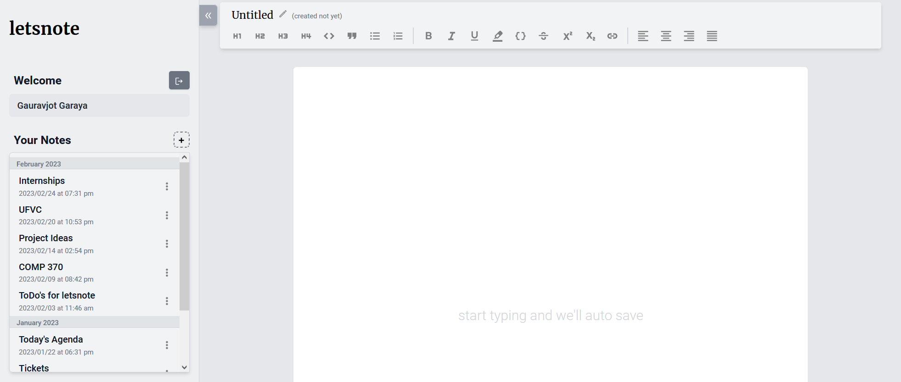
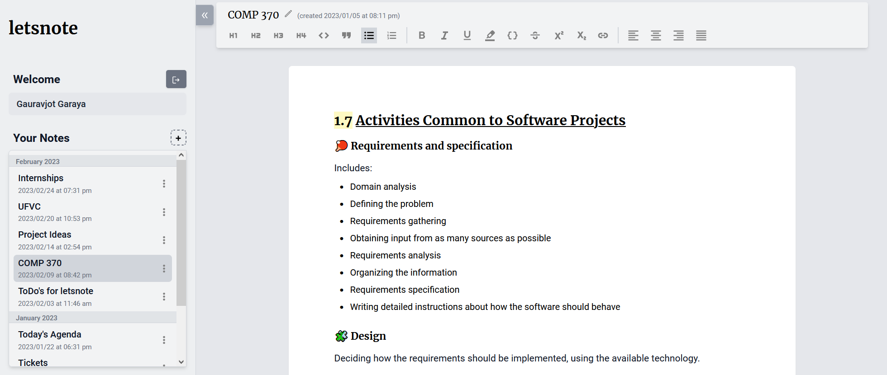
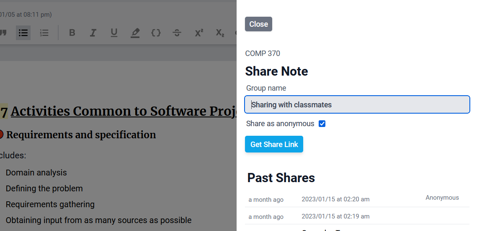
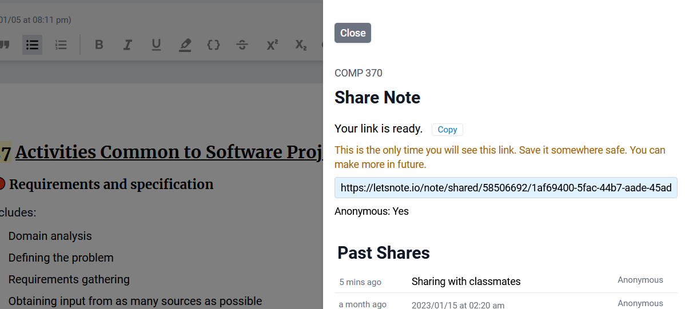
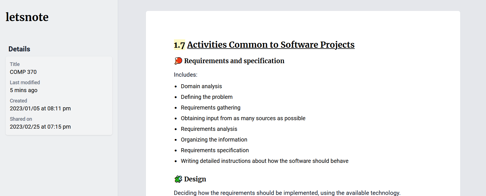

👆 https://letsnote.io

_Demo acc: `test@letsnote.io`
Password: `alphatesting`_

A rich text note writing application. Letsnote's engine automatically saves notes and let users share with others.

## 🎰 Technologies

| Stack    | Tech         |
| -------- | ------------ |
| Frontend | `React.js`   |
| Backend  | `Django`     |
| Database | `PostgreSQL` |

## 🎨 Gallery

-   Landing page
    

-   Page with a note open
    

-   Share note interface
    

-   Share note link
    

-   On opening a shared link
    
