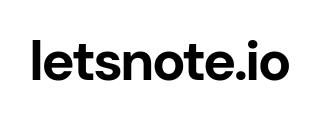

🖱 <https://letsnote.io>

A rich text note-writing application. Letsnote's engine automatically saves notes and lets users share them with others.

_Demo acc: `test@letsnote.io`
Password: `@lphaT3sting`_

## Technologies

| Stack    | Tech         |
| -------- | ------------ |
| Frontend | `React.js`   |
| Backend  | `Django`     |
| Database | `PostgreSQL` |

## Features

1. **Rich Text Editor** - Letsnote uses `Slate.js` to provide a rich text editor for note writing.
2. **Encrypted Storage** - Notes are stored in an encrypted format in the database.
3. **Sharing** - Users can share notes with others by generating a unique link.
4. **Cross-Device** - Users can create an account to manage their notes from any device. [WIP: Forgot password, and email verification]
5. **Auto Save** - Notes are automatically saved as the user types. (2 seconds delay to prevent spamming the server)

## Gallery

Landing page

---

Share note interface

---

Share page

---

Account Management

## Contributing

There are several ways you can contribute to this project:

1. Code Contributions: You can help us by writing code, fixing bugs, and implementing new features. Check out the Issues section for tasks that need attention or suggest improvements.

2. Bug Reports: If you encounter a bug while using Letsnote, please report it in the Issues section. Be sure to include relevant details that can help us reproduce the issue.

3. Feature Requests: Have an idea for a new feature? Share it with us in the Issues section. We encourage discussions around potential enhancements to the project.

## License

This project is licensed under the Apache License 2.0 - see the [LICENSE.md](LICENSE.md) file for details.
